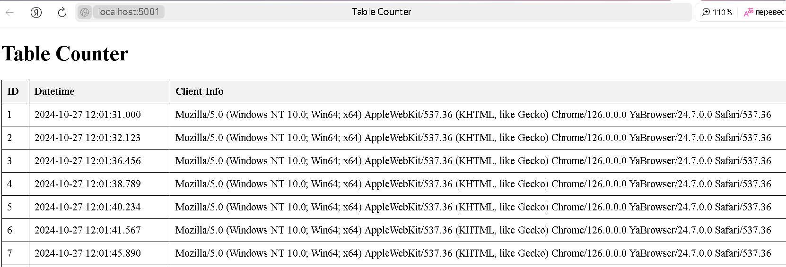
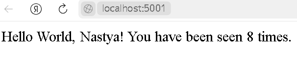

# Использование Docker в приложении Flask с БД

---

# Задание:

На основе файлов проекта с приложением-счетчиком на Flask, продемонстрированного на прошлом занятии, реализовать развертывание приложения-счетчика, реализованного в предыдущем задании с использованием с одной из следующих СУБД: Mongo, PostgreSQL, MySQL / Maria DB с использованием Docker Compose.
В базе данных должно храниться не только значение счетчика, но и данные о том, когда запрос был сделан (для того, чтобы использовать эту информацию в дальнейшем). 

---

## Инструкция по установке

### Шаг 1. Установка Docker и Docker Compose

Перед началом работы установите Docker и Docker Compose

### Шаг 2. Сборка и запуск приложения

Для сборки контейнеров выполните:

```bash
   docker-compose build
   ```
    
Для запуска контейнера используйте:

```bash
   docker-compose -p flask-app up -d
   ```

Для остановки контейнера используйте:

```bash
   docker-compose -p flask-app up -d
   ```

### Результаты

## Таблица



## Посещение



